# AMC Deployer

## Main classes
TODO add links to classes in GitHub

**[DeploymentTypesConfiguration](https://github.com/mulesoft/amc-deployer/blob/master/amc-deployer-service/src/main/java/com/mulesoft/amc/deployer/clients/registry/model/DeploymentTypesConfiguration.java)** 

Configuration for each deployment type as defined in [atlas](https://github.com/mulesoft/amc-atlas/blob/master/src/main/resources/types/providers/providerTypes.yml)

**[TargetProvider](https://github.com/mulesoft/amc-deployer/blob/master/amc-deployer-service/src/main/java/com/mulesoft/amc/deployer/model/domain/TargetProvider.java)**

Target providers as defined in [atlas](https://github.com/mulesoft/amc-atlas/blob/master/src/main/resources/types/providers/providerTypes.yml) but harcoded as an Enum class.
Possible targets are:
* MC: Mule cloud - Used for Runtime Fabric deployment (RTF on-prem, CH 2.0). Most common deployment types are: Mule application, Edge, EdgeConfig, PoseidonAgent (Runtime Fabric agent), Tokenizer.
* IP: Infra provisioner - Used to provision infrastructure in runtime fabric (mainly private spaces). Most common deployment types are: Network, Cluster
* RR: Runtime Remote - Used for standalone runtimes in hybrid. Only for Flex Gateways.

**[TargetInfo](https://github.com/mulesoft/amc-deployer/blob/master/amc-deployer-service/src/main/java/com/mulesoft/amc/deployer/clients/registry/model/TargetInfo.java)**

The target is the actual runtime plane in which a deployment is going to be done. Deployments have a reference to the target runtime plane based on their targetId, targetProvider code (MC, IP, RR), orgId and (optional) envId. 

Properties:
* id 
* type
* availability: status which can be AVAILABLE, UNAVAILABLE, MAINTENANCE_MODE
* Set<NodeInfo> nodes: Each node that can be used for deployment with id, location (word location, string), isAvailableForDeployments, availability ()
* defaults: Defaults per deployment type
* List<Runtime> runtimes: runtimes (and their versions) supported by the target
* replicationStrategies 
* featureFlags: target feature flags - not all targets support all features.

**[Spec](https://github.com/mulesoft/amc-deployer/blob/9c38537f72a3e0e4042cbc0042bd61bc94dac164/amc-deployer-service/src/main/java/com/mulesoft/amc/deployer/model/domain/Spec.java)**

Defines a deployment specification. Each time an update (add, delete, update) to a deployment is made, it's done by sending a new desired state represented by an Spec object.


## Components interaction

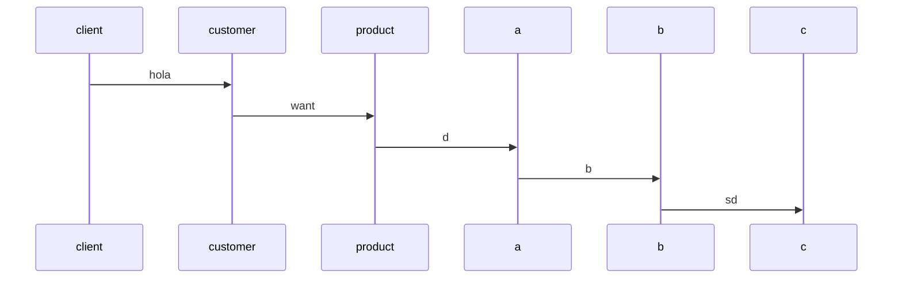

### Deployment - Initial request
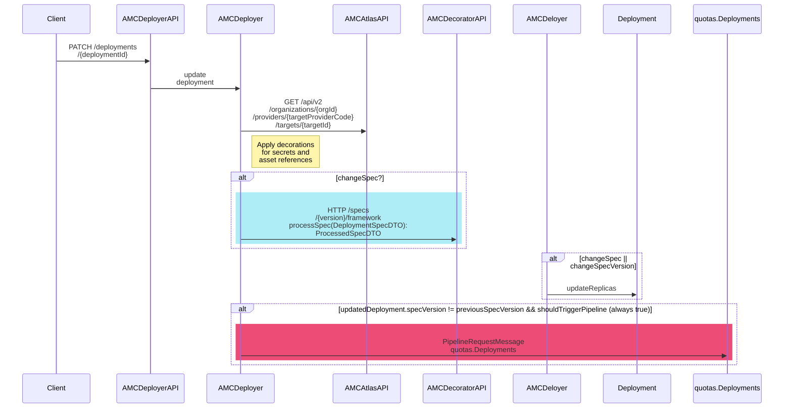

### Deployment - Quotas 
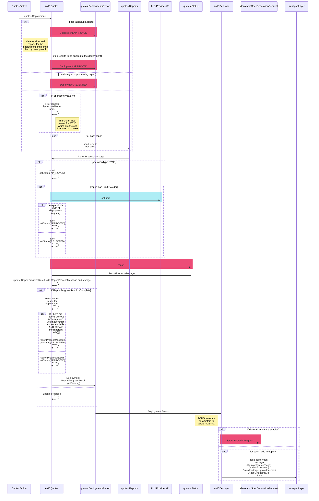


Questions: 
 * In the diagram above there's an update in the deployment and the specVersion may have change. Examples of changes in a specVersion and how it can affect a deployment?
<!--toc:start-->

- [AMC Deploy - Sequence diagrams](#amc-deploy-sequence-diagrams)
  - [Deployment Update](#deployment-update)
  <!--toc:end-->

## Deployment - Decoration Process

Description: This is the entire process for decorating a specification. A request is sent to queue spec.SpecDecorationRequest in the Decorator Broker TODO complete

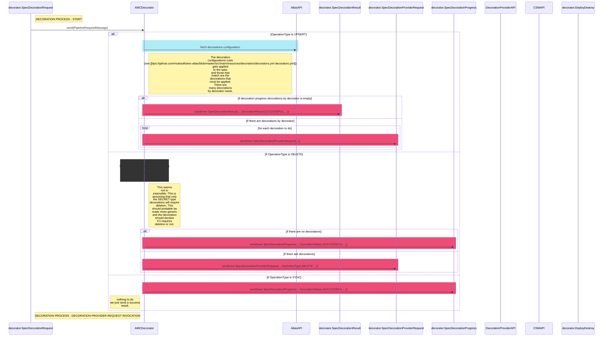

# bla
```mermaid
%%{
  init: 
    { "sequence": 
      { "wrap": true,
        "diagramMarginY": 1
      } 
    }
}%%
sequenceDiagram
decorator.SpecDecorationProviderRequest ->> AMCDecorator: send(DecorationProcessMessage)

alt OperationType is UPSERT
  alt if all stored decorations are DecorationStatus.SUCCESSUL
    AMCDecorator ->> decorator.SpecDecorationProgress : send(new SpecDecorationProgress(.., DecorationStatus.SUCCESSUL, ..))
    note left of AMCDecorator: A successful <br>message is sent <br>for the decorations <br>of this decoration <br>provider. <br>TODO review why this <br>case could happen.
  else if decorations hasn't being execute by the provider
    
    AMCDecorator ->> DecorationProviderAPI : GET /{endpoint}     

    rect reg(156, 247, 215) 
      note right of DecorationProviderAPI : {endpoint} it's <br>defined in Atlas <br><a href='https://github.com/mulesoft/amc-atlas/blob/60d5c5dd8e0c4ec1c525e2d09af823808a9add4e/src/main/resources/decorators/decorators.yml#L62'>decorator configuration</a>.
    end
    alt if all decorations are successful
      AMCDecorator ->> decorator.SpecDecorationProgress: send(new SpecDecorationProgress(.., DecorationStatus.SUCCESSUL, ..))
    else if there are failed decorations
      AMCDecorator ->> decorator.SpecDecorationProgress: send(new SpecDecorationProgress(.., DecorationStatus.FAILED, ..))
    end
  end
else OperationType is DELETE
  loop for each secret decoration
    AMCDecorator ->> CSMAPI: DELETE /secrets-manager<br>/internal/api/v1<br>/organizations/{orgId}<br>/environments/{envId}<br>/clients/{clientId}<br>/secretsGroup/{secretGroupId}<br>/sharedSecrets/  
    note right of CSMAPI: environtments/{envId} <br>is optional given<br> that the secret <br>may not be related <br>to an env.
  end 
  AMCDecorator ->> decorator.SpecDecorationProgress: send(new SpecDecorationProgress(.., DecorationStatus.SUCCESSUL, ..))
end

note right of decorator.SpecDecorationRequest: DECORATION PROCESS - DECORATION PROCESS PROVIDER RESULTS
decorator.SpecDecorationProgress ->> AMCDeployer: send(DecorationProgressMessage)

alt if OperationType.UPSERT
  AMCDecorator ->> AMCDecorator: retrieve all decorations
  alt if decorations continues in progress or decorations deleted
    AMCDecorator ->> AMCDecorator: process finishes here and the progress message is diregarded
  else decorations results are complete
    alt if all decorations progress are success
     AMCDecorator ->> decorator.SpecDecorationResult: send(new SpecDecorationResult(.., DecorationStatus.SUCCESSUL,.. )) 
    else if there are failure decorations progress
     AMCDecorator ->> decorator.SpecDecorationResult: send(new SpecDecorationResult(.., DecorationStatus.FAILURE,.. )) 
    end
  end
else if OperationType.DELETE
  alt if decoration progress is successful
    AMCDeployer ->> AMCDeployer: delete decorations from DB
    note right of AMCDeployer: Deleting secrets <br>after successfully <br>deleted them <br> from CSM
  end
  alt if there's not secrets pending to be deleted
    AMCDeployer ->> AMCDeployer: delete all decorations for this deployment
  end
  AMCDeployer ->> AMCDeployer: retrieve DecorationProgress from DB
  alt there is no DecorationProgress stored 
    AMCDeployer ->> AMCDeployer: finish process, deletion already happened 
  else  there is DecorationProgress stored
    alt DecorationProgress.type is DESTROY
      AMCDeployer ->> decorator.DeployReply: send(new DestroyMessage(..))
    else
      AMCDeployer ->> decorator.SpecDecorationResult: send(new DecorationResult(DecorationStatus.SUCCESSUL))
    end
  end
end
decorator.SpecDecorationProviderRequest ->> AMCDecorator: send(DecorationProcessMessage)

alt OperationType is UPSERT
  alt if all stored decorations are DecorationStatus.SUCCESSUL
    AMCDecorator ->> decorator.SpecDecorationProgress : send(new SpecDecorationProgress(.., DecorationStatus.SUCCESSUL, ..))
    note left of AMCDecorator: A successful <br>message is sent <br>for the decorations <br>of this decoration <br>provider. <br>TODO review why this <br>case could happen.
  else if decorations hasn't being execute by the provider
    
    AMCDecorator ->> DecorationProviderAPI : GET /{endpoint}     

    rect reg(156, 247, 215) 
      note right of DecorationProviderAPI : {endpoint} it's <br>defined in Atlas <br>[[https://github.com/mulesoft/amc-atlas/blob/60d5c5dd8e0c4ec1c525e2d09af823808a9add4e/src/main/resources/decorators/decorators.yml#L62 decorator configuration]].
    end
    alt if all decorations are successful
      AMCDecorator ->> decorator.SpecDecorationProgress: send(new SpecDecorationProgress(.., DecorationStatus.SUCCESSUL, ..))
    else if there are failed decorations
      AMCDecorator ->> decorator.SpecDecorationProgress: send(new SpecDecorationProgress(.., DecorationStatus.FAILED, ..))
    end
  end
else OperationType is DELETE
  loop for each secret decoration
    AMCDecorator ->> CSMAPI: DELETE /secrets-manager<br>/internal/api/v1<br>/organizations/{orgId}<br>/environments/{envId}<br>/clients/{clientId}<br>/secretsGroup/{secretGroupId}<br>/sharedSecrets/  
    note right of CSMAPI: environtments/{envId} <br>is optional given<br> that the secret <br>may not be related <br>to an env.
  end 
  AMCDecorator ->> decorator.SpecDecorationProgress: send(new SpecDecorationProgress(.., DecorationStatus.SUCCESSUL, ..))
end

note right of decorator.SpecDecorationRequest: DECORATION PROCESS - DECORATION PROCESS PROVIDER RESULTS
decorator.SpecDecorationProgress ->> AMCDeployer: send(DecorationProgressMessage)

alt if OperationType.UPSERT
  AMCDecorator ->> AMCDecorator: retrieve all decorations
  alt if decorations continues in progress or decorations deleted
    AMCDecorator ->> AMCDecorator: process finishes here and the progress message is diregarded
  else decorations results are complete
    alt if all decorations progress are success
     AMCDecorator ->> decorator.SpecDecorationResult: send(new SpecDecorationResult(.., DecorationStatus.SUCCESSUL,.. )) 
    else if there are failure decorations progress
     AMCDecorator ->> decorator.SpecDecorationResult: send(new SpecDecorationResult(.., DecorationStatus.FAILURE,.. )) 
    end
  end
else if OperationType.DELETE
  alt if decoration progress is successful
    AMCDeployer ->> AMCDeployer: delete decorations from DB
    note right of AMCDeployer: Deleting secrets <br>after successfully <br>deleted them <br> from CSM
  end
  alt if there's not secrets pending to be deleted
    AMCDeployer ->> AMCDeployer: delete all decorations for this deployment
  end
  AMCDeployer ->> AMCDeployer: retrieve DecorationProgress from DB
  alt there is no DecorationProgress stored 
    AMCDeployer ->> AMCDeployer: finish process, deletion already happened 
  else  there is DecorationProgress stored
    alt DecorationProgress.type is DESTROY
      AMCDeployer ->> decorator.DeployReply: send(new DestroyMessage(..))
    else
      AMCDeployer ->> decorator.SpecDecorationResult: send(new DecorationResult(DecorationStatus.SUCCESSUL))
    end
  end
end

```


## AMC Deployer sequence diagrams

### Deployment Update - API Endpoint

API: [PATCH /deployments/{deploymentId}]
From:

- AMC Deployer - DeploymentServiceTest.concurrencyExceptionOnRepositoryShouldBeCaught

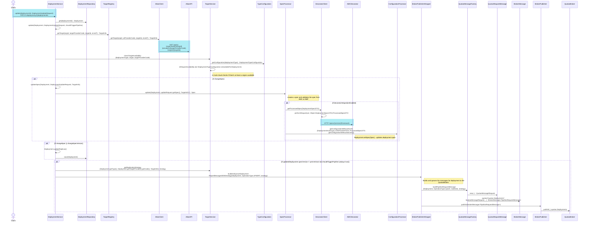

### Process message back from quotas - JMS Listener

JMS Broker: Quotas ; queue: quotas.DeploymentsReport
Description: Deployer Process messages coming from quotas to move deployment to next phase or update the deployment if it was rejected.

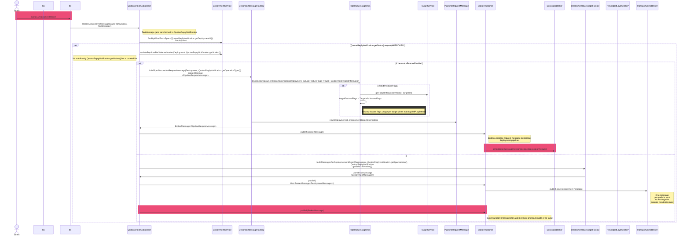

TODO add link between both diagrams

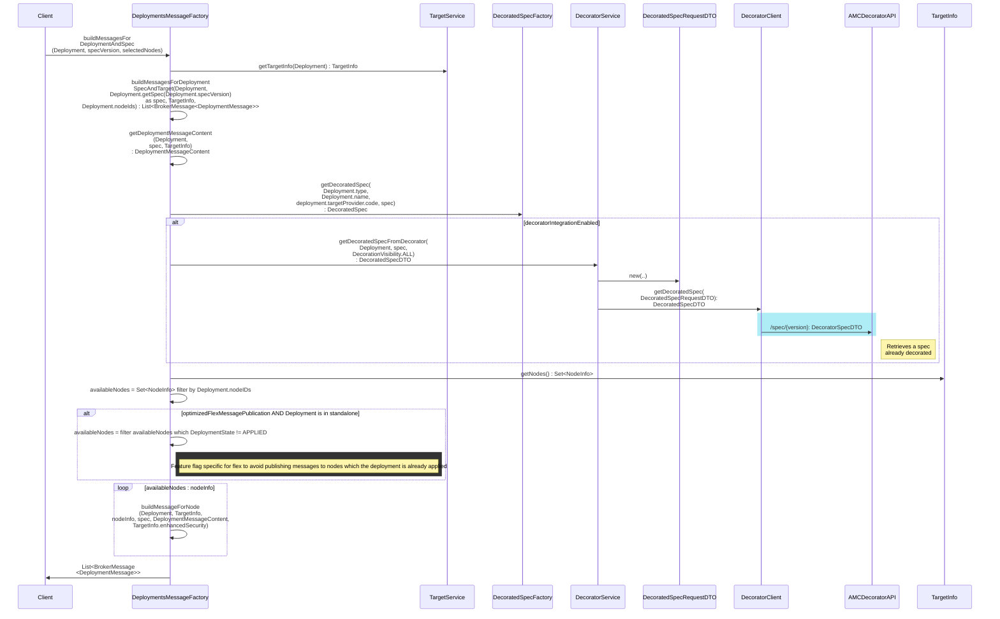

### BrokerPublisher - JMS message sender

Description: Builds and queues the messages for deployment. Based on the list of input messages it will introspect each message and send the message to different brokers / queues. All JMS messages are sent through this class.

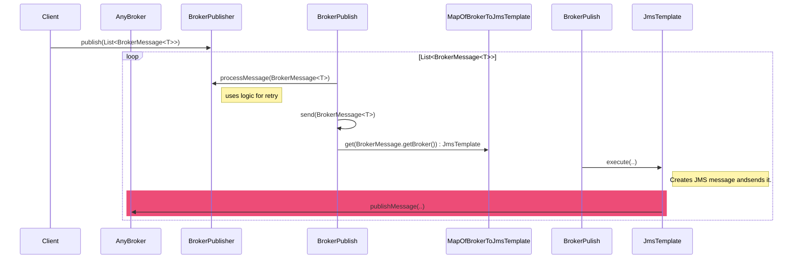

MapOfBrokerToJmsTemplate is actually a Map<Broker, JmsTemplate> and gets created using this code in BrokerPublisher constructor:

```java
brokersJmsTemplates.put(TRANSPORT_LAYER, transportLayerJmsTemplate);
brokersJmsTemplates.put(NOTIFICATION_BUS, notificationBusJmsTemplate);
brokersJmsTemplates.put(QUOTAS_BROKER, quotasJmsTemplate);
brokersJmsTemplates.put(DECORATOR_BROKER, decoratorJmsTemplate);
```

Configuration values are obtained from `application.yml` file which gets configured by env properties.

### Get TargetInfo 

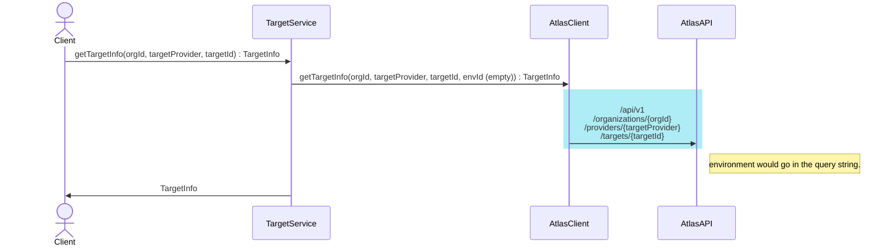

### Publish synchronize notification - API Endpoint

API: [POST /admin/usage/sync]

Description: Forces a synchronization of deployments status. 


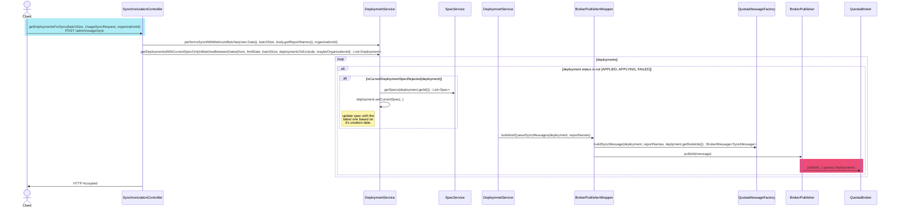

### Process decoration result - JMS Decorator Broker - decorator.SpecDecorationResult 

Description: Deployer Process messages coming from decorator to complete deployment sending the message the TL or update the deployment if it was rejected.

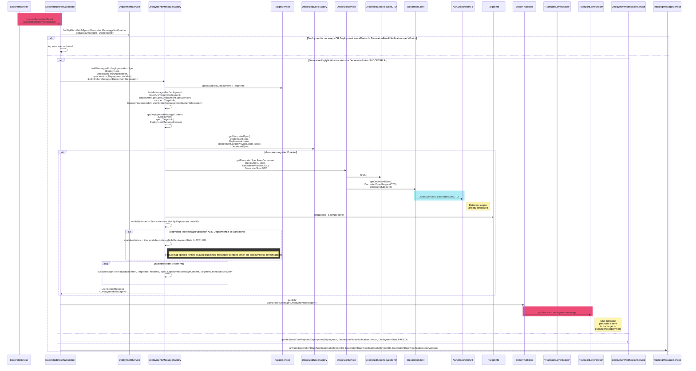

## Destroy -- Document

Description: This seems to be a queue used from a Target to notify Deployer that the target has been modified/deleted etc.
